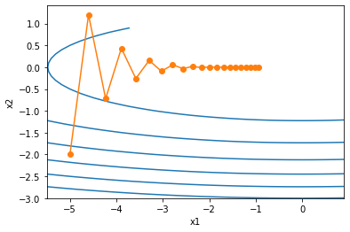
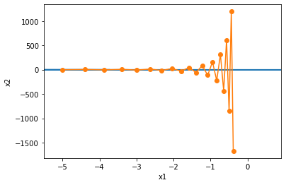
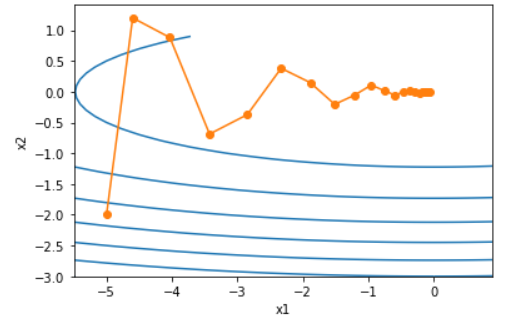
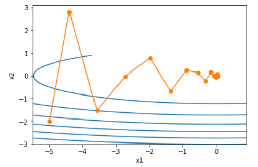

#### Momentum

出发点：如果自变量的迭代方向仅仅取决于自变量当前的位置，这可能会带来一些问题，结合物理上动量的思想。优化过程更平滑.

随机梯度下降，eps分别为0.4、0.6时，优化轨迹：

使用动量方法之后：

看一下动量法的更新公式：

$y_t=\beta y_{t-1}+ (1-\beta)x_t$

对$y_t$展开：
$$
\begin{align}
y_t&=(1-\beta)x_t+\beta y_{t-1}\\
&=(1-\beta)x_t+(1-\beta)\cdot{x_{t-1}}+\beta^2y_{t-2}\\
&=(1-\beta)x_t+(1-\beta)\cdot{x_{t-1}}+\beta^2x_{t-2}+\beta^3y_{t-3}\\
&=(1-\beta)\sum^t_{i=0}{\beta^ix_{t-i}}
\end{align}
$$

$$
(1-\beta)\sum^t_{i=0}\beta^i=\frac {1-\beta^t}{1-\beta}(1-\beta)=1-\beta^t
$$

例如：当$\beta=0.95$时，
$$
y_t\approx0.05\sum^{19}_{i=0}{0.95^ix_{t-i}}
$$
因此，在实际中，我们常常将$y_t$看作是对最近$1/(1-\beta)$个时间步的$x_t$值的加权平均，上式可以看作对最近20个时间步的$x_t$的加权平均，而且离当前时间步t跃进的$x_t$值获得的权重越大(越接近1)。

#### AdaGrad

根据自变量在每个维度的梯度值的大小来调整各个维度上的学习率，从而避免同一的学习率难以适应所有维度的问题
$$
x_1\leftarrow x_1-\eta\frac{\partial f}{\partial{x_1}},x_2\leftarrow x_2-\eta\frac{\partial f}{\partial{x_2}}
$$
使用一个小批量随机梯度$g_t$按元素平方的累加变量$s_t$.

初始化$s_t$为零，然后将小批量随机梯度$g_t$按元素平方累加到变量$s_t$:
$$
s_t\leftarrow s_{t-1}+g_t\odot g_t \\
x_t\leftarrow x_{t-1}-\frac{\eta}{\sqrt{s_t+\epsilon}}\odot g_t
$$

##### Feature

小批量随机梯度按元素平方的累加变量$\boldsymbol{s}_t$出现在学习率的分母项中。因此，如果目标函数有关自变量中某个元素的偏导数一直都较大，那么该元素的学习率将下降较快；反之，如果目标函数有关自变量中某个元素的偏导数一直都较小，那么该元素的学习率将下降较慢。然而，由于$\boldsymbol{s}_t$一直在累加按元素平方的梯度，自变量中每个元素的学习率在迭代过程中一直在降低（或不变）。所以，当学习率在迭代早期降得较快且当前解依然不佳时，AdaGrad算法在迭代后期由于学习率过小，可能较难找到一个有用的解。

#### RMSProp

不同于AdaGrad算法里状态变量$s_t$是截至时间步t所有小批量随机梯度按元素平方和。RMSProp算法将这些梯度按元素平方做指数加权移动平均
$$
v_t\leftarrow \beta v_{t-1}+(1-\beta)g_t\odot{g_t}\\
x_t\leftarrow x_{t-1}-\frac{\alpha}{\sqrt{v_t+\epsilon}}\odot g_t
$$

#### AdaDelta

除了RMSProp外，AdaDelta也针对AdaGrad算法在迭代后期可能较难找到有用解的问题做了改进。
$$
s_t\leftarrow \rho{s_{t-1}}+(1-\rho)g_t\odot{g_t}\\
g^1_t\leftarrow{\sqrt{\frac{\Delta{x_{t-1}+\epsilon}}{s_t+\epsilon}}}\odot{g_t}\\
x_t\leftarrow{x_{t-1}-g^1_t}\\
\Delta{x_t}\leftarrow{\rho\Delta{x_{t-1}}+(1-\rho)g^1_t\odot{g^1_t}}
$$

#### Adam

Adam算法使用了动量变量$m_t$和RMSProp算法中小批量随机梯度按元素平方的指数加权平均变量$v_t$.

时间步t的动量变量$m_t$即小批量随机梯度$g_t$的指数加权移动平均：
$$
m_t\leftarrow{\beta_1m_{t-1}+(1-\beta_1)g_t}\\
v_t\leftarrow{\beta_2v_{t-1}+(1-\beta_2)g_t\odot{g_t}}\\
\hat{m_t}\leftarrow{\frac{m_t}{1-\beta^t_1}}\\
\hat{v_t}\leftarrow{\farc{v_t}{1-\beta^t_2}}
$$
