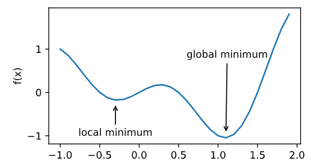
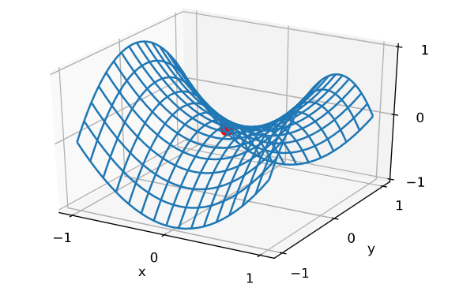
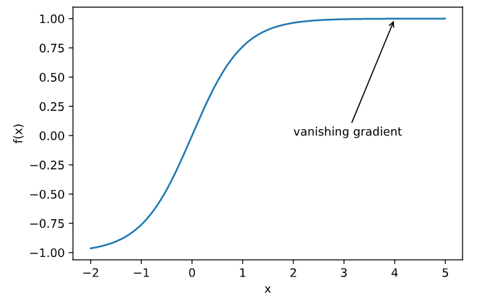

#### 凸优化

优化方法可以最小化深度学习中的损失函数值，但本质上优化方法达到的目标与深度学习的布标并不相同

+ 优化方法目标：训练集损失函数值
+ 深度学习目标：测试集损失函数值

优化问题在深度学习中的挑战：

1. 局部最小值
2. 鞍点
3. 梯度消失

##### 局部最小值

$f(x)=xcos\pi{x}$

##### 鞍点

在微分方程中，沿着某一方向是稳定的，另一条方向是不稳定的奇点，叫做鞍点

在矩阵中，一个数在所在行中是最大值，在所在列中是最小值，叫做鞍点

在泛函中，既不是极大值点也不是极小值点的临界点，叫做鞍点

一阶偏导数为0，海森矩阵特征值有正有负

##### 梯度消失

##### 凸性（Convexity）

+ 无局部极小值
+ 与凸集的关系
+ 二阶条件，二阶导大于零

